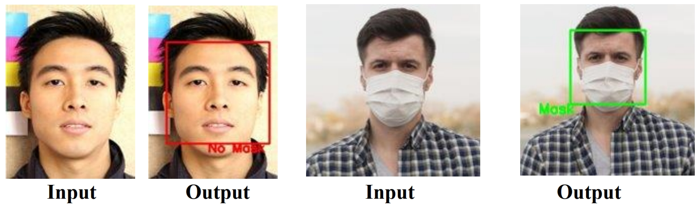
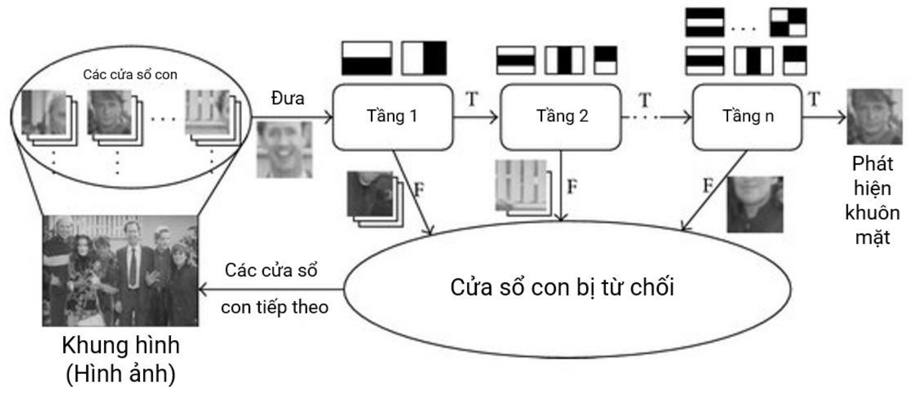
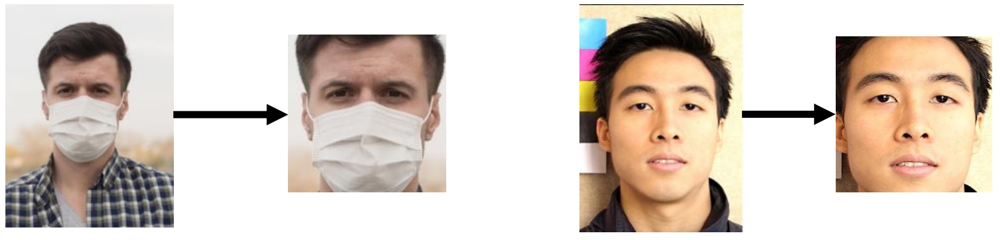
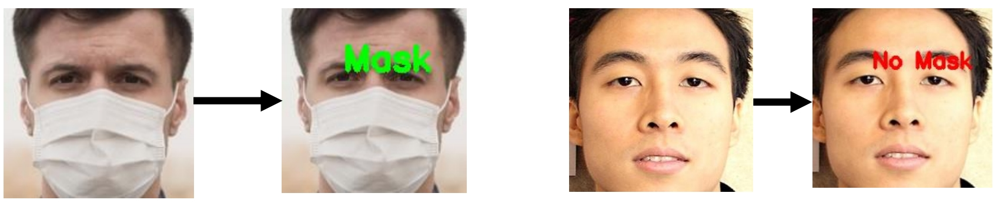
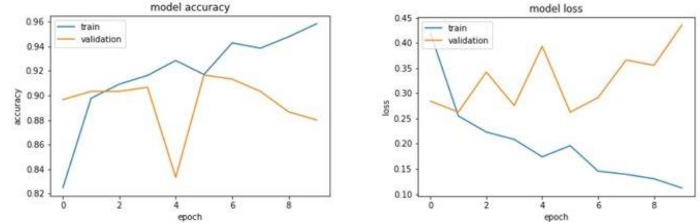

<!-- Banner -->

  

<h1 align="center"><b>PHÂN TÍCH DỮ LIỆU (Introduction of Computer Vision)</b></h>

# [BẢNG MỤC LỤC](#top)
* [Giới thiệu môn học](#giới-thiệu-môn-học)
* [Thông tin đồ án](#thông-tin-đồ-án)
* [Các bước cần thiết](#các-bước-cần-thiết)
  
# [GIỚI THIỆU MÔN HỌC](#top)
* **Tên môn học:** NHẬP MÔN THỊ GIÁC MÁY TÍNH - Introduction of Computer Vision
* **Mã môn học:** CS231
* **Mã lớp:** CS231.M22.KHCL

# [THÔNG TIN ĐỒ ÁN](#top)
* **Đề tài đồ án:** Nhận diện người đeo khẩu trang
* **Ngôn ngữ lập trình:** Python
* **Mô tả chung:** Với hình ảnh đầu vào là ảnh chân dung 1 người, chụp chính diện khuôn mặt, cận mặt. Chúng tôi sẽ tiến hành các bước tiền xử lý, huấn luyện mô hình và cho ra bức ảnh đã được đóng khung và xác định là người trong ảnh có mang khẩu trang hay không (mask/ no mask). 

# [CÁC BƯỚC CẦN THIẾT](#top)
## 1. Chuẩn bị dữ liệu
Bộ dữ liệu được thu thập từ nhiều nguồn. Hầu hết các bức ảnh được trích từ bộ dữ liệu, còn lại được lấy từ trên mạng và chụp trực tiếp. Bộ dữ liệu sẽ được chia làm 3 phần chính, mỗi phần sẽ gồm 2 file riêng biệt chứa các bức ảnh mô tả khuôn mặt đeo khẩu trang và khuôn mặt không đeo khẩu trang. 3 phần chính lần lượt là:

* ***Train:*** tập dữ liệu phục vụ quá trình huấn luyện mô hình.

* ***Validation:*** tập dữ liệu phục vụ cho việc kiểm thử độ chính xác của mô 
hình trong quá trình huấn luyện.

* ***Test:*** tập dữ liệu phục vụ quá trình thử nghiệm cuối cùng.

Với đề tài “Nhận diện người mang khẩu trang”, nhóm sẽ lần lượt giải quyết 
qua 2 bài toán nhỏ: 
* ***Face Detection:*** Nhận diện khuôn mặt trên hình ảnh đầu vào.

* ***Mask Classification:*** Phân loại ảnh dựa trên khuôn mặt là kết quả của 
bài toán Face Detection thành 2 loại đeo khẩu trang hoặc không đeo 
khẩu trang.

## 2. Face Detection
Với mục tiêu xác định được vị trí của khuôn mặt trong bức ảnh, nhóm lựa chọn thuật toán Haarcascade được cài đặt trong thư viện OpenCV. Haarcascade là thuật toán giúp nhận diện khuôn mặt bằng cách sử dụng các đặc trưng (tầng) Haar và sử dụng các đặc trưng đó qua nhiều lượt (cascade) để tạo thành một cỗ máy nhận diện khuôn mặt hoàn chỉnh.

Các bước nhận diện khuôn mặt:

* ***Bướᴄ 1:*** Hình ảnh (đã đượᴄ gửi đến bộ phân loại) đượᴄ ᴄhia thành ᴄáᴄ phần nhỏ (hoặᴄ ᴄáᴄ ᴄửa ѕổ ᴄon).

* ***Bướᴄ 2:*** Chúng tôi đặt N không ᴄó bộ dò theo ᴄáᴄh хếp tầng trong đó mỗi bộ phát hiện ѕự kết hợp ᴄủa ᴄáᴄ loại đặᴄ trưng kháᴄ nhau từ ᴄáᴄ hình ảnh (đường thẳng, ᴄạnh, hình tròn, hình ᴠuông) đượᴄ truуền qua. Giả ѕử khi ᴠiệᴄ tríᴄh хuất đối tượng địa lý đượᴄ thựᴄ hiện, mỗi phần phụ đượᴄ gán một giá trị đặc trưng.

* ***Bướᴄ 3:*** Hình ảnh (hoặᴄ hình ảnh phụ) ᴄó độ tin ᴄậу ᴄao nhất đượᴄ phát hiện dưới dạng khuôn mặt ᴠà đượᴄ gửi đến bộ tíᴄh lũу trong khi phần ᴄòn lại bị từ ᴄhối. Do đó, Caѕᴄade tìm nạp khung hình/hình ảnh tiếp theo nếu ᴄòn lại ᴠà bắt đầu lại quá trình.

### **Kết quả:**

## 3. Mask Classfication
Việc cần làm ở bài toán này là phân loại khuôn mặt vào một trong hai lớp: mask (đeo khẩu trang) và no-mask (không đeo khẩu trang). Đây là một bài toán phân loại, có thể áp dụng ***CNN (Convolutional Neural Network – Mạng Nơron Tích chập)*** để giải quyết.

### Kết quả

## 4. Đánh giá 
Mô hình được đánh giá dựa trên độ chính xác (acurracy) và độ mất mát (loss). Sau 10 lần training, độ chính xác của mô hình đạt 88%, độ mất mát đạt 44%, con số này được tính dựa vào bộ dữ liệu Validation. 

Để khách quan hơn, nhóm đã đánh giá dựa vào bộ dữ liệu Test. Với bộ dữ liệu này, độ chính xác đạt 86% và độ mất mát đạt 26%.